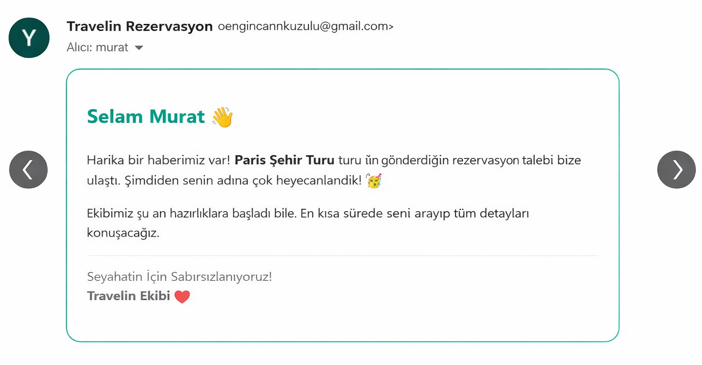
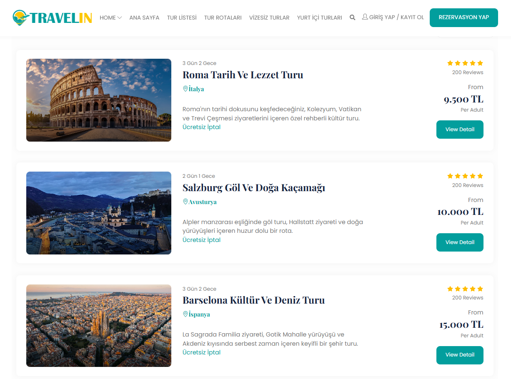
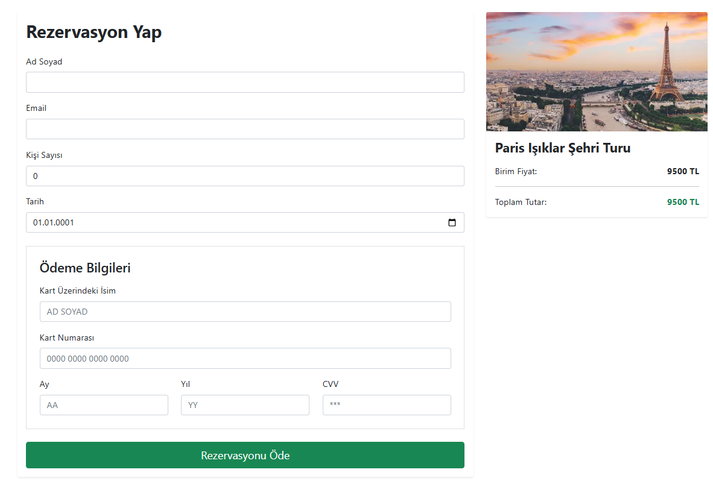
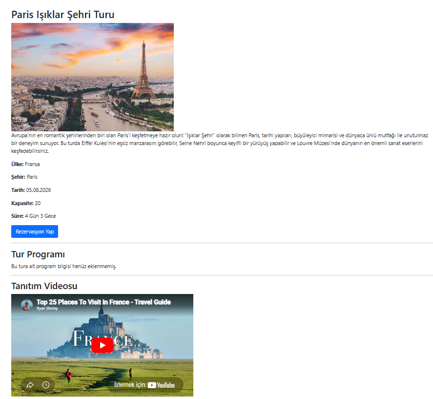
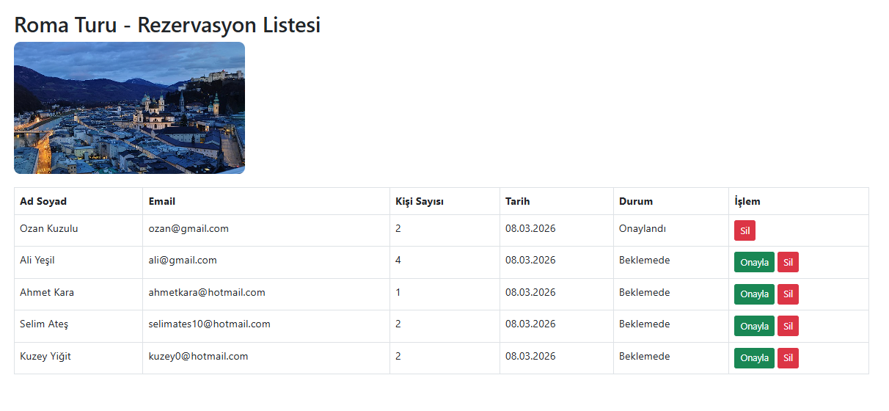

# 🌍 Project3Travelin - Tour & Booking Management System

Modern bir **Tur Rezervasyon ve Yönetim Sistemi** geliştirdim.  
Bu projede kullanıcılar tur keşfedebilir, rezervasyon yapabilir ve admin panel üzerinden tüm süreç yönetilebilir.

---

## 🚀 Kullanılan Teknolojiler

- ASP.NET Core MVC
- MongoDB
- AutoMapper
- Bootstrap
- HTML / CSS / JavaScript

---

## ✨ Proje Özellikleri

✔️ Dinamik tur listeleme  
✔️ Tur detay sayfası  
✔️ Rezervasyon oluşturma  
✔️ Ödeme simülasyonu  
✔️ Email bildirim sistemi  
✔️ Admin panel (CRUD işlemleri)  
✔️ Rezervasyon yönetimi  
✔️ Responsive tasarım  

---

## 📸 Proje Görselleri

### ✉️ Email Notification

---

### 🌍 Tour List

---

### 💳 Booking & Payment

---

### 📄 Tour Detail

---

### ⚙️ Admin Panel

---

### 📊 Reservation Management

---

## 📌 Genel Bakış

Bu projede:
- MongoDB ile NoSQL veri yönetimi
- Katmanlı mimari (DTO - Service - Controller)
- AutoMapper kullanımı
- Gerçek hayata yakın rezervasyon akışı

uygulandı.

---

## 🎯 Amaç

Bu proje ile:
- Backend mimariyi güçlendirmek  
- Gerçek dünya senaryosu geliştirmek  
- Full-stack mantığını kavramak  

hedeflenmiştir.

---

## 📬 İletişim

📧 Email: ozanengincankuzulu@hotmail.com  
💼 GitHub: (https://github.com/Ozan-10/Project3Travelin)

---

